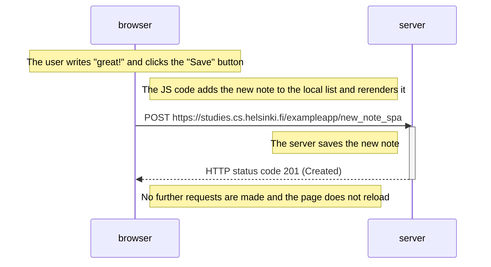

```mermaid
sequenceDiagram
    participant browser
    participant server

    Note over browser: The user writes "great!" and clicks the "Save" button

    Note right of browser: The JS code adds the new note to the local list and rerenders it

    browser->>server: POST https://studies.cs.helsinki.fi/exampleapp/new_note_spa
    activate server
    Note left of server: The server saves the new note
    server-->>browser: HTTP status code 201 (Created)
    deactivate server
    Note right of browser: No further requests are made and the page does not reload
```